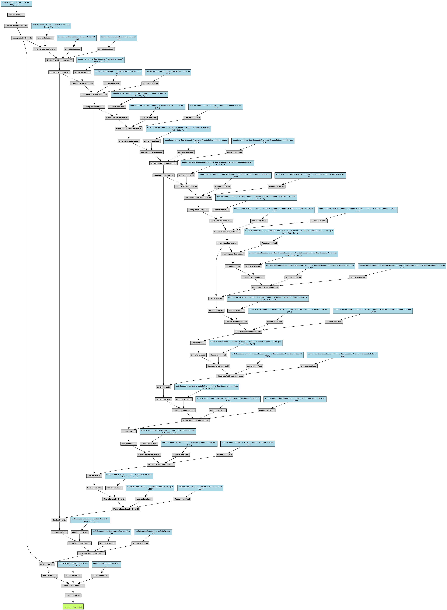
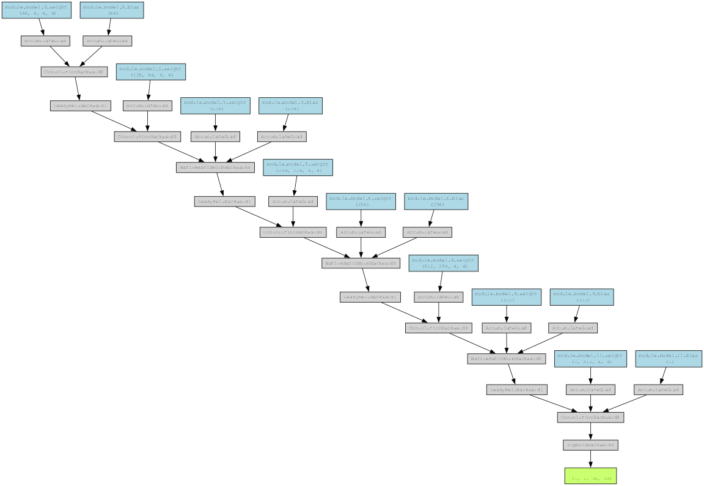

# RGB-to-Thermal Image Translation using Conditional GAN (Pix2Pix)

This project implements a **Conditional Generative Adversarial Network (cGAN)** to translate **RGB images → Thermal images**.  
The goal is to learn the mapping between visible light images and their corresponding thermal infrared representations.

This type of model is useful in:

- Surveillance
- Robotics & autonomous navigation
- Night vision & low-light enhancement
- Industrial inspection
- Remote sensing & disaster response

---

# Dataset Structure

The dataset contains paired RGB and Thermal images with the **same filenames**.

Dataset/
│
├── train/
│ ├── rgb/
│ └── thermal/
│
└── valid/
├── rgb/
└── thermal/

Each RGB and Thermal image pair is automatically matched using filenames.  
Only pairs that exist in both folders are used.

---

# Model Overview

This project uses the **Pix2Pix architecture**, which includes:

### **Generator (U-Net based)**
- Encoder–decoder model with skip connections  
- Learns RGB → Thermal mapping  
- Outputs a 3-channel thermal-like image  

### **Discriminator (PatchGAN)**
- Operates on 70×70 patches  
- Judges whether a (RGB, Thermal) pair is real or fake  
- Forces generator to produce realistic thermal textures  

---

